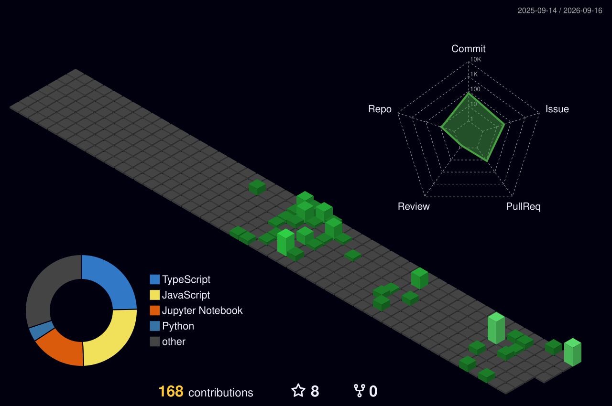
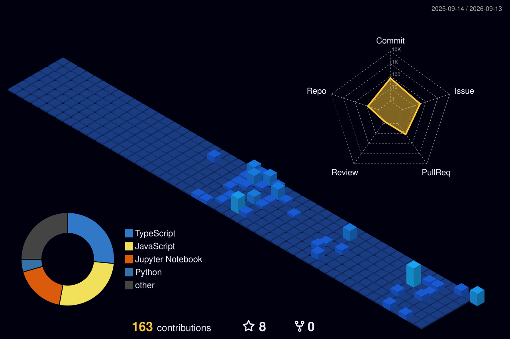

<div align="center">


<p align="center">
  <!-- <a href="https://linkedin.com/in/priya-kumari"></a> -->
  <a href="https://twitter.com/priyaku92735600"></a>
  <a href="https://github.com/Dhanwi"></a>
  <a href="https://www.leetcode.com/dhanwi"></a>
  <a href="https://www.hackerrank.com/_priya_"></a>
</p>


</div>

<br>

##  About Me

```yaml
role: Software Development Engineer (GenAI & Full-Stack)
focus:
  - LLM Orchestration frameworks (LangGraph, LangChain)
  - Retrieval-Augmented Generation (RAG) pipelines at production scale
  - FastAPI & Node.js microservice architectures
  - High-performance React / TypeScript UI systems
currently: Building autonomous multi-agent systems for enterprise SRE & knowledge workflows
ask_me_about: [GenAI system design, RAG architecture, microfrontends, 0→1 product builds]
```

-  **GenAI Systems Engineer** — designed and shipped multi-agent, RAG, and stateful conversational systems used in enterprise environments
-  **Full-Stack Architect** — built [Kaaryasetu], a MERN + AI platform serving **550+ active users** and a **500+ member** community
-  **Microfrontend Optimizer** — improved load performance and modularity across large-scale React frontends
-  **Cloud & Infra** — deploys and scales services on **AWS EC2**, with hands-on production DevOps experience
-  Ask me about **GenAI system design, RAG architecture, agentic workflows, or building from 0 → 1**

<br>

##  Featured Work

<details open>
<summary><b> Recall — Enterprise RAG Platform</b></summary>
<br>

> Retrieval-Augmented Generation pipeline built for accurate, context-grounded enterprise knowledge retrieval.

| Area | Details |
|---|---|
| **Core** | Chunking, embedding & retrieval pipeline over enterprise knowledge sources |
| **Orchestration** | LangChain / LangGraph pipelines for retrieval + generation flow |
| **Backend** | FastAPI services exposing retrieval & Q&A endpoints |
| **Goal** | Reduce hallucination and ground LLM answers in verified source documents |

</details>

<details>
<summary><b> Sentinel — Multi-Agent SRE Copilot</b></summary>
<br>

> A multi-agent system that assists Site Reliability Engineers with incident triage, diagnostics, and remediation guidance.

| Area | Details |
|---|---|
| **Architecture** | Multi-agent orchestration with LangGraph — specialized agents for detection, diagnosis & remediation |
| **Backend** | Python microservices for log/metric ingestion and agent coordination |
| **Value** | Speeds up incident response by automating first-pass root-cause analysis |

</details>

<details>
<summary><b> Nexa — Stateful Conversational Chatbot</b></summary>
<br>

> A conversational AI system that maintains long-running context and state across multi-turn interactions.

| Area | Details |
|---|---|
| **Core** | Persistent conversation state & memory management across sessions |
| **Orchestration** | LangChain-based dialogue flow with tool-calling support |
| **Backend** | Node.js / FastAPI hybrid service layer |

</details>

<details>
<summary><b> Kaaryasetu — Full-Stack MERN AI Platform</b></summary>
<br>

> Full-stack platform built end-to-end and scaled since launch in March 2025.

| Area | Details |
|---|---|
| **Stack** | React, Node.js, Express, MongoDB |
| **Auth** | Google OAuth |
| **AI Features** | Cold-email generator using OpenAI, Groq & LLaMA APIs |
| **Infrastructure** | AWS EC2 — deployed, managed & scaled |
| **Community** | Led a frontend bootcamp · 500+ member community |
| **Impact** | 550+ active users since March 2025 launch |


</details>

<br>

##  Tech Stack

<details open>
<summary><b> GenAI & LLM Orchestration</b></summary>
<br>


</details>

<details open>
<summary><b> Frontend & Desktop</b></summary>
<br>


</details>

<details open>
<summary><b> Backend & Databases</b></summary>
<br>


</details>

<details open>
<summary><b> Cloud & DevOps</b></summary>
<br>


</details>

<br>

##  GitHub Analytics

<!-- <div align="center">
  
  
</div> -->

<div align="center">
  
</div>

<div align="center">
  
</div>

<br>

## 3D Contribution Skyline
<div align="center">  <br><br>  </div> <p align="center"><i>Auto-generated daily via GitHub Actions — see <code>.github/workflows/profile-3d.yml</code></i></p> <br>

##  Let's Connect

Open to collaborating on GenAI systems, agentic architectures, or full-stack products — reach out anytime.

<p align="left">
  <a href="https://linkedin.com/in/priya-kumari"></a>
  <a href="https://twitter.com/priyaku92735600"></a>
  <a href="https://medium.com/kajalgupta02012001"></a>
  <a href="https://www.buymeacoffee.com/dbgpriyakuT"></a>
</p>


</div>
